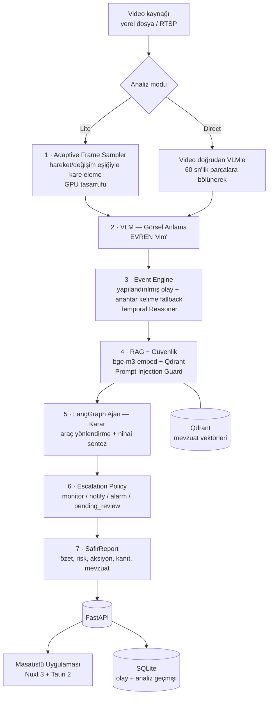

# SAFİR — Proje Dokümantasyonu

**Saha Analiz ve Farkındalık İçin Yapay Zekâ Destekli Karar Sistemi**
TEKNOFEST 2026 · Takım: **team33 (biAgent)**

> Bu doküman şartnamenin "Proje Dokümantasyonu" maddesindeki sekiz başlığı sırasıyla karşılar.
> Kurulumun ayrıntılı, komut-komut hâli için ayrıca [`safir-ai/KURULUM.md`](safir-ai/KURULUM.md).

---

## 1. Sistem Mimarisinin Genel Özeti ve Diyagramı

SAFİR, saha kamerası görüntüsünü alıp **operatörün doğrudan uygulayabileceği bir karara** dönüştüren
uçtan uca bir boru hattıdır. Tasarımın iki ana ilkesi vardır:

1. **Risk skoru LLM'e bırakılmaz.** Nihai skor deterministik bir kural motoru (RuleEngine + risk
   modeli) ile ajanın taslak skorunun birleşimidir ve her skorun *nereden geldiği* raporda izlenebilir
   (`risk_source`, `contributing_rule_ids`, `deterministic_score`, `llm_proposed_score`).
2. **Veri uydurulmaz.** Ölçülemeyen bir metrik `—` olarak gösterilir; deterministik kanıt yokken
   otomatik alarm atılmaz, karar operatöre bırakılır (`pending_review`).

### Boru hattı (7 aşama)



### Bileşenler

| Katman | Teknoloji | Dosya |
|---|---|---|
| API | FastAPI + uvicorn | `safir-ai/src/main.py` |
| Kare örnekleme | OpenCV (CPU) | `safir-ai/src/sampler/` |
| Görsel anlama (VLM) | EVREN `vlm` | `safir-ai/src/vlm/` |
| Olay analizi | Event Engine + Temporal Reasoner + Rule Engine | `safir-ai/src/event_analysis/` |
| Bellek / RAG | SQLite + Qdrant + `bge-m3-embed` | `safir-ai/src/memory/`, `safir-ai/src/rag/` |
| Ajan | LangGraph durum makinesi | `safir-ai/src/agent/` |
| Karar / eskalasyon | RuleEngine, risk modeli, EscalationPolicy | `safir-ai/src/decision/` |
| Güvenlik | Prompt Injection Guard | `safir-ai/src/security/` |
| Gözlemlenebilirlik | Trace serializer + SSE | `safir-ai/src/observability/` |
| Masaüstü arayüz | Nuxt 3 + Tauri 2 + Tailwind | `desktop/` |
| Operatör paneli (opsiyonel) | Streamlit | `safir-ai/src/ui/` |

### Başlıca API uçları

`GET /health` · `POST /analyze/jobs` · `GET /analyze/jobs/{id}` · `GET /analyze/jobs/{id}/stream` (SSE canlı trace)
`GET /history`, `GET /history/{id}`, `GET /history/{id}/report.pdf`
`POST /ask`, `GET /ask/stream` (SAFİR Asistan) · `POST /alerts/trigger`, `POST /alerts/{id}/acknowledge`
`POST /events/{id}/feedback` · `GET /system/overview`

---

## 2. Kullanılan Agentic Framework ve LLM'ler

### Agentic framework

**LangGraph** (`langgraph`, `langchain-core`) üzerine kurulu bir durum makinesi:
`SafirAgent` (`safir-ai/src/agent/langgraph_agent.py`) düğümleri arasında **ajan → araç → ajan**
döngüsü çalışır; araçlar `StructuredTool` olarak bağlanır (Dynamic Tool Router,
`safir-ai/src/agent/tools.py`). Çıktı, şema doğrulamalı tek bir JSON karardır; serbest metin geldiğinde
**guided JSON retry** ile tek seferlik JSON-modu yeniden denemesi yapılır.

### Model hiyerarşisi (EVREN servisi)

Şartnamenin EVREN altyapısı kullanılır; **her görev için en büyük model çağrılmaz**, hiyerarşi kurulur:

| Rol | Model | Nerede |
|---|---|---|
| Görsel anlama (video/kare) | `vlm` | VLM aşaması — `vlm.active_model: evren`, `vlm.frames_model: evren_frames` |
| Araç seçimi / JSON üretimi / guard | `llm-fast` | Ajan muhakeme döngüsü — `llm.active_model: evren` |
| Nihai karar sentezi | `llm-large` | Döngü bittiğinde tek çağrı — `llm.decision_model: evren_large` |
| Embedding (RAG) | `bge-m3-embed` (1024 boyut) | Mevzuat semantik araması |

Tümü `configs/config.yaml` ile yönetilir; kod içinde model adı sabitlenmez. Anahtarlar `.env`
içindeki `EVREN_*` değişkenlerinden okunur.

**Tek sağlayıcı politikası:** sistem yalnızca EVREN altyapısını kullanır. Geliştirme sırasında geçici
olarak bulunan Gemini ve Groq sağlayıcıları — prompt-injection guard backend'leri, `google-genai`
bağımlılığı, `requirements-gemini.txt` ve ilgili API anahtarları — repodan tamamen kaldırılmıştır;
`guard.provider` yalnızca `"evren"` değerini kabul eder.

**Reranking bilinçli olarak kullanılmaz:** EVREN dokümantasyonu saf yoğun getirmenin (R@1 = 0.95) her
yeniden sıralama varyantından iyi olduğunu, rerank'in R@1'i 0.55'e düşürdüğünü gösterdiği için
LLM-as-judge reranker devre dışı bırakılmıştır (bir ağ çağrısı + gecikme de tasarruf edilir).

---

## 3. İmplemente Edilen Senaryolar ve Mock Fonksiyonlar

### Analiz senaryoları (iki bağımsız mod)

| Mod | Akış | Ne zaman |
|---|---|---|
| **Direct** | Video, 60 sn'lik parçalara bölünüp doğrudan VLM'e gönderilir | Yüksek doğruluk; EVREN video yeteneği |
| **Lite** | Adaptive Frame Sampler kareleri eler, kalan kanıt kareleri gruplar hâlinde VLM'e gider | Düşük bütçe/donanım; ölçülen GPU tasarrufu ~%58 |

### Tanınan olay kategorileri

Sekizi doğrudan bir İSG mevzuat maddesiyle eşlenmiştir (`EVENT_TYPE_REGULATION_MAP`):

| Olay türü | Dayanak |
|---|---|
| `dusme_riski` | İSG Yönetmeliği Madde 12 |
| `kkd_ihlali` | İSG Yönetmeliği Madde 24 |
| `arac_yaya_yakinligi` | Operasyonel Kural OK-07 |
| `sicak_calisma_ihlali` | İSG Yönetmeliği Madde 31 |
| `yangin_duman` | Yangın Güvenliği Talimatı YG-03 |
| `dar_alan_ihlali` | İSG Yönetmeliği Madde 45 |
| `enerji_kesme_ihlali` | Operasyonel Kural OK-15 (LOTO) |
| `agir_yuk_riski` | İSG Yönetmeliği Madde 52 |
| `yetkisiz_erisim`, `genel_gozlem` | Mevzuat dışı, operasyonel izleme |

Taksonomiye girmeyen olaylar da kaybolmaz; serbest biçimli `event_name` ile taşınır
(`detected_event_names`).

### Mock fonksiyonlar — ajanın araçları

Şartnamenin "mock fonksiyonların ajanın araçları olarak kullanılması" gereksinimi için **üç mock aksiyon
aracı** tanımlıdır. Bunlar iç sorgu araçlarından farklıdır: ajan **kendi muhakemesiyle**, sahada bir
eylemi simüle etmek için çağırır; gerçek bir dış sisteme bağlanmaz, loglar ve bir onay metni döndürür.

| Araç | Ne zaman çağrılır | Girdi |
|---|---|---|
| `notify_health_team_tool` | Yaralanma, düşme, bilinç kaybı | `event_id`, `urgency`, `note?` |
| `dispatch_security_tool` | Yetkisiz erişim, güvenlik ihlali | `zone`, `reason` |
| `trigger_area_lockdown_tool` | Aktif yangın/patlama/gaz kaçağı (en ağır kademe) | `zone`, `reason` |

**Politika** (sistem isteminde tanımlı): `risk_score >= 51` **ve** gözlem bu kategorilerden birine net
giriyorsa, ajan aracı `actions` metnine yazmadan **önce gerçekten çağırır**; düşük/orta riskte veya
kategori net değilse çağırmaz (alarm yorgunluğu önlenir).

Çağrılan araçlar `AgentDecision.triggered_mock_actions` → `SafirReport.triggered_mock_actions` yoluyla
rapora işlenir ve arayüzde ("Ajanın Çağırdığı Mock Aksiyon Araçları"), JSON/HTML/PDF raporlarında
açıkça gösterilir.

**Mock aksiyonlar, otomatik eskalasyondan ayrıdır:** `EscalationPolicy` risk skoruna göre
deterministik ve ajandan bağımsız çalışır (`monitor` / `notify` / `alarm` / `pending_review`).

### Ajanın diğer (salt-okuma) araçları

`sql_tool` (geçmiş olay sorgusu) · `retriever_tool` (mevzuat semantik araması) ·
`timeline_tool` (zaman aralığı) · `verification_tool` (risk iddiasının çapraz doğrulaması).

### Geliştirici mock modu

`configs/config.yaml` → `app.use_mock_vlm: true` + `use_mock_llm: true` ile **hiçbir harici servise
bağlanmadan** tüm boru hattı çalıştırılabilir (`MockVLMClient` / `MockLLMClient`). Demo ve sunum için
bu bayraklar **`false`** olmalıdır.

---

## 4. Projenin Çalıştırılması — Adım Adım

### Gereksinimler

- Python 3.12
- Node.js 20+ (masaüstü arayüz için)
- GPU **zorunlu değildir** — görsel/dil modelleri EVREN servisinden çağrılır
- Docker **gerekmez** (proje Docker kullanmaz)

### 1) Arka uç (API)

```bash
cd safir-ai
python -m venv .venv
```

```bash
.venv\Scripts\pip install -r requirements-dev.txt
```

`.env` dosyasına EVREN erişim bilgileri girilir (`.env.example` şablondur):

```bash
copy .env.example .env
```

Gerekli anahtarlar: `EVREN_BASE_URL`, `EVREN_API_KEY`, `EVREN_TEAM`, `EVREN_QDRANT_URL`, `EVREN_QDRANT_KEY`.

Sunucuyu başlatın:

```bash
.venv\Scripts\python -m uvicorn src.main:app --host 127.0.0.1 --port 8000
```

Açılışta dört model ısıtılır (`vlm`, `llm-fast`, `llm-large`, `bge-m3-embed`); log'da
`Model isinma: ... -> OK` satırlarını görmelisiniz. Sağlık kontrolü:

```bash
curl http://127.0.0.1:8000/health
```

### 2) Masaüstü arayüz

```bash
cd desktop
```

```bash
npm install
```

Geliştirme (tarayıcı):

```bash
npm run dev
```

Masaüstü uygulaması (Tauri):

```bash
npm run tauri:dev
```

### 3) Testler

```bash
cd safir-ai
```

```bash
.venv\Scripts\python -m pytest -q
```

### 4) Analiz çalıştırma

Arayüzden: **Direct** veya **Lite** modunu seçin → *Video Seç* → *Analizi Başlat*.
API'den:

```bash
curl -X POST http://127.0.0.1:8000/analyze/jobs -H "Content-Type: application/json" -d "{\"video_source\":\"C:/videolar/ornek.mp4\"}"
```

Dönen `job_id` ile `GET /analyze/jobs/{job_id}` (durum) veya
`GET /analyze/jobs/{job_id}/stream` (canlı SSE trace) izlenir.

Ayrıntılı native kurulum (kendi vLLM'inizi çalıştırmak dâhil): [`safir-ai/KURULUM.md`](safir-ai/KURULUM.md).

---

## 5. Karşılaşılan Zorluklar ve Getirilen Çözümler

| Zorluk | Çözüm |
|---|---|
| **VLM'in tüm videoya tek piksel bütçesi uygulaması** — uzun videolarda ayrıntı kayboluyordu | Video otomatik olarak ardışık **60 sn'lik parçalara** bölünüp her parça ayrı istekte gönderiliyor (`video_chunker.py`), sonuçlar tek olay listesinde birleştiriliyor |
| **LLM'in her zaman geçerli JSON üretmemesi** | Şema doğrulaması + **tek seferlik guided JSON retry** (JSON-modu, araçsız); yine olmazsa "degraded" karar döner, risk **uydurulmaz** |
| **"Risk 0" ile "analiz başarısız"ın ayırt edilememesi** (P0) | Başarısız analizde `risk_score=None`, `risk_status="unknown"`; arayüzde "Belirsiz" olarak ayrı gösterilir |
| **LLM'in tek başına alarm tetikleyebilmesi riski** | Deterministik kural kanıtı yokken `EscalationPolicy` **`pending_review`** verir, otomatik alarm atmaz; karar operatöre bırakılır ve gerekçesi raporda yazar |
| **Skorun nereden geldiğinin izlenememesi** | `RiskProvenance`: `deterministic_score`, `llm_proposed_score`, `contributing_rule_ids`, `scoring_method` alanları ve arayüzde "Risk Doğruluğu — Hesaplama Detayı" bloğu |
| **Yeniden sıralamanın (rerank) doğruluğu düşürmesi** | EVREN ölçümlerine dayanarak reranker tamamen kaldırıldı; saf yoğun getirme + deterministik ağırlıklı skor |
| **Belge/istem üzerinden prompt injection** | `PromptInjectionGuard` — şüpheli içerik karantinaya alınır, sistem talimatı olarak asla uygulanmaz (`test_prompt_injection_guard.py`) |
| **Farklı analizlerin olaylarının birbirine karışması** | Olaylara `analysis_id` / `model_call_id` / `chunk_id` **provenance** eklendi; seçici yalnızca bu çağrıya ait olayları alır (`test_selector_isolation.py`) |
| **Uzun analiz sırasında arayüzün "donmuş" görünmesi** | SSE ile aşama-aşama canlı trace + VLM parça ilerleme bildirimi (`chunk_index / total_chunks`) |
| **Mock modun aslında harici servise istek atması** | `MockVLMClient.reconcile_events` yerel birleştirme yapacak şekilde düzeltildi — mock mod artık gerçekten çevrimdışı çalışır |
| **Kare-tabanlı yolda hata yakalayıcının kendisinin çökmesi** | `_stage_vlm_frames` içindeki tanımsız `context` değişkeni giderildi; VLM hatasında artık gerçekten "degraded rapor" üretiliyor |

---

## 6. Eklenen Ek Özellikler

- **SAFİR Asistan** — analiz bağlamını ve İSG mevzuatını bilen, akış (SSE) destekli soru-cevap;
  konuşma geçmişi kalıcı, kullanıcı **PDF/DOCX belge yükleyip** o belge üzerinden soru sorabilir.
- **İki bağımsız analiz modu** (Direct / Lite) — aynı arka uç, iki ayrı sunum ve maliyet profili.
- **Canlı ölçüm destesi** — sol altta **AI Metrikleri** (token, çağrı, gecikme, çağrı türü kırılımı) ve
  **KPI Metrikleri** panelleri; yatay kaydırma veya düğmeyle geçiş.
- **Rapor dışa aktarma** — şartname formatında JSON, tek dosyalık HTML ve kanıt kareleri gömülü
  **gerçek PDF** (reportlab).
- **Kalıcı geçmiş + trace** — tamamlanan her analizin raporu *ve* boru hattı izi saklanır; geçmiş bir
  analiz açıldığında aynı arayüzle yeniden incelenebilir.
- **Human-in-the-loop** — manuel saha alarmı tetikleme, alarm onaylama (acknowledge), olay için
  doğru/yanlış-pozitif geri bildirimi.
- **Sistem Verileri ekranı** — toplam analiz, RAG sorgu sayısı, ortalama embedding gecikmesi, guard
  karantina sayısı gibi işletim metrikleri.
- **Erişilebilirlik ve operasyon kolaylıkları** — açık/koyu tema, tam ekran modu, klavye kısayolları
  (`/` ara, `n` yeni analiz, `f` tam ekran, `r` yenile), kritik riskte sesli alarm.

---

## 7. Ölçümleme Sonuçları

### Tanımlanan KPI'lar

Sistemin başarısı, **yalnızca gerçek analiz verisinden** hesaplanan beş ölçütle izlenir
(`desktop/app/composables/useKpiMetrics.ts`). Ölçülemeyen bir KPI `—` gösterilir, sayı uydurulmaz.

| KPI | Formül |
|---|---|
| **Olay Tespit Doğruluğu** | Tespit edilen olayların ortalama güven skoru (confidence) |
| **Özet Kalitesi** | Dolu rapor özet alanı ÷ 7 (özet, doğal dil özeti, gerekçe, zaman çizelgesi, kanıt karesi, olay türü, mevzuat) |
| **Aksiyon Önerisi Doğruluğu** | Geçen tutarlılık kontrolü ÷ 5 (öneri metni, aksiyon listesi, eskalasyon kademesi, risk–kademe uyumu, tetiklenen aksiyon) |
| **Kritik Olay Yakalama Oranı** | Kritik/yüksek şiddetli kural eşleşmesi olan olay türü ÷ tespit edilen olay türü |
| **İşlem Süresi** | Uçtan uca analiz süresi (sampler ölçümü; yoksa boru hattı adım sürelerinin toplamı) |

### Uçtan uca koşu sonuçları

Gerçek EVREN servisiyle, `dataset` klasöründeki videolarla alınmıştır:

| Video | Mod | Süre | Risk | Eskalasyon | Mevzuat | PDF |
|---|---|---|---|---|---|---|
| `kapısıkışması.mp4` | Direct | 40 sn | 75 / yüksek | `pending_review` | 5 madde | 107 KB ✓ |
| `tik.mp4` | Direct | 36 sn | 95 / kritik | `pending_review` | 5 madde | 96 KB ✓ |
| `A101.mp4` | Lite | 321 sn | 0 / düşük | `monitor` | — | ✓ |

**Adaptive Frame Sampler (A101.mp4, Lite):** 398 kare tarandı → 167 kanıt karesi, 231 kare elendi,
**%58,04 GPU tasarrufu**, örnekleme süresi 14,2 sn.

**Model çağrı profili** (tik.mp4, AI Metrikleri panelinden): 6 çağrı, 46,6 B giden / 1.293 gelen token,
ortalama gecikme ~13 sn.

**Bir koşunun KPI çıktısı** (tik.mp4): Olay Tespit Doğruluğu %100 · Özet Kalitesi %71,4 ·
Aksiyon Önerisi Doğruluğu %60 · İşlem Süresi 32,9 sn.

### Test kapsamı

`pytest` ile **799 test geçiyor**, 12 test ortama/bilinen sınırlamalara bağlı olarak
başarısız (aşağıda listelenmiştir). Mock aksiyon araçları, ajan karar döngüsü, rapor şeması,
eskalasyon, prompt-injection guard ve boru hattı entegrasyon testlerinin tamamı geçer.

### Bilinen sınırlamalar

- **Yapılandırılmamış VLM çıktısında olay kaybı:** VLM anlatı metni üretip yapılandırılmış olay
  döndürmediğinde, anahtar-kelime yolundan türeyen olayların provenance kimliği olmadığı için
  çağrı-seçici bunları eliyor; rapordaki `events` listesi boş kalıyor ve buna bağlı olarak
  "Kritik Olay Yakalama Oranı" ölçülemiyor. Kök neden `src/main.py::_select_current_call_events`;
  düzeltme, fallback olaylara da provenance etiketi eklemektir (izolasyon garantisine dokunduğu için
  ayrı ele alınacaktır).
- Ortama bağlı test hataları: Windows'ta geçici SQLite dosyasının teardown'da kilitli kalması
  (`test_ask.py`), video yolu normalizasyonu ve örnekleyici yoğunluk testleri.
- `src/vlm/analysis_aggregator.py` şu an hiçbir yerden çağrılmayan ölü koddur; testi mevcut
  `VideoChunk` sözleşmesiyle uyumsuzdur.

---

## 8. Ölçekleme Noktasında Gerekli İhtiyaçlar

### Mevcut durum

Tek süreçli FastAPI; işler bellek içi bir kuyrukta, **aynı anda tek analiz** varsayımıyla yürütülür.
Kalıcılık SQLite (analiz/olay geçmişi) ve Qdrant (mevzuat vektörleri) üzerindedir.

### Ölçeklerken gereken adımlar

| Alan | İhtiyaç |
|---|---|
| **Eşzamanlılık** | Bellek içi kuyruk yerine dış kuyruk (Redis/RabbitMQ) + ayrı worker süreçleri; `job_id` zaten var, worker'lar durum/trace'i paylaşılan bir kanaldan yayınlamalı |
| **Veritabanı** | SQLite tek yazar sınırına takılır → çok kullanıcı/çok worker senaryosunda PostgreSQL |
| **Model kapasitesi** | EVREN kotası tek darboğaz; kendi barındırmanız gerekirse video-yetenekli bir VLM için ~32 GB VRAM (örn. RTX 5090) ve `vllm serve` ile iki ayrı model süreci (bkz. KURULUM.md) |
| **Vektör deposu** | Qdrant tek düğümde yeter; mevzuat seti büyürse koleksiyon başına replikasyon ve snapshot yedeği |
| **Depolama** | Kanıt kareleri ve PDF raporlar analiz başına ~100 KB–1 MB; uzun süreli saklama için nesne deposu (S3 uyumlu) ve saklama süresi politikası |
| **Canlı kamera (RTSP)** | Şu an dosya/tek akış odaklı; N kamera için kamera başına örnekleyici süreci ve kare-üretim hızına göre yatay ölçek |
| **Gözlemlenebilirlik** | Mevcut trace + `/system/overview` yeterli tabandır; çok worker'da merkezî log toplama ve istek başına korelasyon kimliği eklenmelidir |
| **Maliyet kontrolü** | Lite mod (%58 kare elemesi) token/GPU maliyetini düşürür; kamera başına örnekleme eşiği ve `chunk_duration_sec` ile bütçe ayarlanabilir |

---

## Dizin Yapısı

```
p3-project/
├─ DOKUMANTASYON.md          # bu doküman
├─ safir-ai/                 # Python arka uç
│  ├─ src/                   # boru hattı, ajan, RAG, API
│  ├─ tests/                 # pytest paketi
│  ├─ scripts/               # model ısıtma, benchmark, KB üretimi
│  ├─ notebooks/             # uçtan uca demo / gezinti defterleri
│  ├─ configs/config.yaml    # tüm model ve eşik ayarları
│  ├─ requirements.txt · requirements-dev.txt · requirements-dashboard.txt
│  ├─ README.md · KURULUM.md
└─ desktop/                  # Nuxt 3 + Tauri 2 masaüstü arayüz
   └─ app/                   # sayfalar, bileşenler, composable'lar
```
