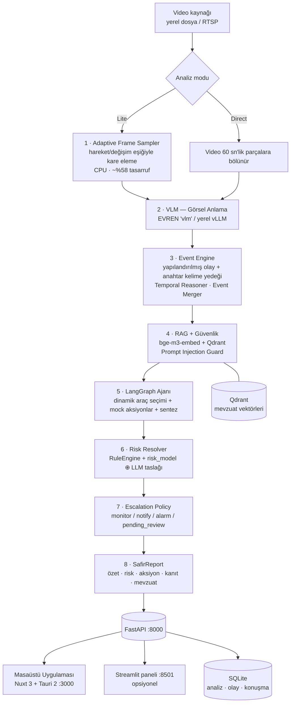

# SAFİR

**Saha Analiz ve Farkındalık İçin Yapay Zekâ Destekli Karar Sistemi**

TEKNOFEST 2026 · Yapay Zekâ Dil Ajanları Yarışması · **3. Senaryo (Video Analiz ve Karar Destek)**
Takım: **team33 (biAgent)** · Depo: `github.com/biAgentTR/safir-ai`

SAFİR, saha/tesis kamerası görüntüsünü alıp **operatörün doğrudan uygulayabileceği bir karara**
dönüştüren, uçtan uca ve **tamamen yerel** çalışan bir video analiz + karar destek sistemidir.
Çıktı; Türkçe özet, zaman damgalı olay listesi, açıklanabilir risk skoru, aksiyon önerileri ve
mevzuat dayanağı içeren tek bir **yapılandırılmış JSON** raporudur.

```
Video  →  Adaptive Frame Sampler  →  VLM (görsel anlama)  →  Olay Analizi + Zamansal Muhakeme
       →  RAG + Güvenlik Süzgeci  →  LangGraph Ajanı (araç kullanımı + muhakeme)
       →  Deterministik Risk Motoru + Eskalasyon  →  SafirReport (JSON / HTML / PDF) + Operatör Arayüzü
```

> **İlgili dokümanlar**
> - [`DOKUMANTASYON.md`](DOKUMANTASYON.md) — şartnamenin "Proje Dokümantasyonu" maddesindeki sekiz başlık
> - [`safir-ai/KURULUM.md`](safir-ai/KURULUM.md) — sıfırdan native kurulum (kendi vLLM'inizi çalıştırmak dâhil)
> - [`safir-ai/README.md`](safir-ai/README.md) — arka uç odaklı hızlı başlangıç
> - [`desktop/README.md`](desktop/README.md) — masaüstü arayüz notları

---

## İçindekiler

1. [Sistem Özellikleri ve Becerileri](#1-sistem-özellikleri-ve-becerileri)
2. [Mimari](#2-mimari)
3. [Dizin Yapısı — Tüm Alt Klasörler](#3-dizin-yapısı--tüm-alt-klasörler)
4. [Kurulum](#4-kurulum)
5. [Sistemi Ayağa Kaldırma — Komutlar](#5-sistemi-ayağa-kaldırma--komutlar)
6. [API Referansı](#6-api-referansı)
7. [Çıktı Formatı (Şartname JSON'u)](#7-çıktı-formatı-şartname-jsonu)
8. [Ölçümleme, KPI ve Testler](#8-ölçümleme-kpi-ve-testler)
9. [Şartname Uyum Matrisi](#9-şartname-uyum-matrisi)
10. [Sorun Giderme ve Bilinen Sınırlamalar](#10-sorun-giderme-ve-bilinen-sınırlamalar)
11. [Ölçekleme İhtiyaçları](#11-ölçekleme-i̇htiyaçları)

---

## 1. Sistem Özellikleri ve Becerileri

### 1.1 Çoklu ortam (multimodal) anlama

| Yetenek | Nasıl |
|---|---|
| **Sahne bütünlüğü ve zamansal ilişki** | Video, kare yığını olarak değil **60 sn'lik ardışık parçalar** hâlinde VLM'e gönderilir (`src/vlm/video_chunker.py`); parça sonuçları tek bir olay hattında birleştirilir |
| **İki bağımsız analiz modu** | **Direct**: video doğrudan VLM'e (en yüksek doğruluk). **Lite**: Adaptive Frame Sampler kareleri eler, yalnızca kanıt kareleri gruplar hâlinde VLM'e gider (ölçülen **~%58 GPU/token tasarrufu**) |
| **Adaptive Frame Sampler** | Dinamik gürültü tabanı (medyan geçmiş penceresi), hysteresis'li erken-değişim kanalı, çift bazlı (hızlı/yavaş) uzun-baz referansı, tek-kare sıçrama tespiti, dedup ve tanılama çıktısı — hepsi CPU'da (`src/sampler/adaptive_sampler.py`) |
| **Ani olay tespiti** | Kare akışında ani değişimleri ayrı bir VLM sorgusuyla derinleştiren `sudden_event_detector` / `sudden_event_analyzer` |

### 1.2 Olay tespiti ve anlamsal yorumlama

- **Olay motoru** (`src/event_analysis/event_engine.py`): VLM'in yapılandırılmış olay çıktısını
  kullanır; gelmezse cümle-bazlı **olumsuzlama farkındalıklı** anahtar kelime yedeğine düşer
  ("baret yok" ≠ "baret var").
- **Zamansal muhakeme** (`temporal_reasoner.py`): olayın **başlangıç → gelişim → sonuç**
  evrelerini ayırır, zamansal oylama penceresiyle tek-kare gürültüsünü eler.
- **Olay birleştirme** (`event_merger.py`): aynı olayın parçalar arası tekrarını tek kayda indirir.
- **Provenance izolasyonu**: her olayda `analysis_id` / `model_call_id` / `chunk_id` taşınır;
  farklı analizlerin olayları birbirine karışmaz.
- **Tanınan 10 olay kategorisi**, sekizi doğrudan bir İSG mevzuat maddesiyle eşlenmiştir:

| Olay türü | Dayanak |
|---|---|
| `dusme_riski` | İSG Yönetmeliği Md. 12 |
| `kkd_ihlali` | İSG Yönetmeliği Md. 24 |
| `arac_yaya_yakinligi` | Operasyonel Kural OK-07 |
| `sicak_calisma_ihlali` | İSG Yönetmeliği Md. 31 |
| `yangin_duman` | Yangın Güvenliği Talimatı YG-03 |
| `dar_alan_ihlali` | İSG Yönetmeliği Md. 45 |
| `enerji_kesme_ihlali` | Operasyonel Kural OK-15 (LOTO) |
| `agir_yuk_riski` | İSG Yönetmeliği Md. 52 |
| `yetkisiz_erisim`, `genel_gozlem` | Operasyonel izleme |

Taksonomiye girmeyen olaylar kaybolmaz; serbest biçimli `event_name` ile taşınır.

### 1.3 Açıklanabilir risk — skor LLM'e bırakılmaz

Nihai risk skoru, **deterministik kural motoru** (`RuleEngine` + `risk_model`) ile ajanın
taslak skorunun harmanıdır ve raporda her skorun *nereden geldiği* izlenebilir:

- `deterministic_score` / `deterministic_level` — yalnızca kurallardan, LLM'den bağımsız
- `llm_proposed_score` — ajanın önerisi
- `risk_score` — nihai (blended) skor · `risk_source` — `rule_engine` | `agent` | `unknown`
- `contributing_rule_ids`, `scoring_method`, `risk_features` (8 normalize özellik),
  `risk_feature_contributions`, `risk_explanation` (Türkçe, LLM'e sorulmamış gerekçe)

**Veri uydurulmaz:** ölçülemeyen bir özellik `None` kalır, arayüzde `—` gösterilir.
`risk_status` alanı "risk 0" ile "analiz başarısız"ı kesin olarak ayırır
(`assessed` / `unclassified` / `unknown`).

### 1.4 Ajan, araçlar ve mock fonksiyonlar

**LangGraph** durum makinesi (`src/agent/langgraph_agent.py`): `agent → tools → agent` döngüsü,
`max_iterations: 6`, araçlar `StructuredTool` olarak dinamik yönlendirilir. Bozuk JSON gelirse
**tek seferlik guided-JSON retry**; yine olmazsa risk uydurulmadan *degraded* karar döner.

**Mock aksiyon araçları** (ajanın kendi muhakemesiyle çağırdığı saha eylemleri — şartnamenin
"mock fonksiyonların ajanın araçları olarak kullanılması" gereksinimi):

| Araç | Ne zaman | Girdi |
|---|---|---|
| `notify_health_team_tool` | Yaralanma, düşme, bilinç kaybı | `event_id`, `urgency`, `note?` |
| `dispatch_security_tool` | Yetkisiz erişim, güvenlik ihlali | `zone`, `reason` |
| `trigger_area_lockdown_tool` | Aktif yangın / patlama / gaz kaçağı | `zone`, `reason` |

Politika: `risk_score >= 51` **ve** gözlem kategoriye net giriyorsa ajan aracı *gerçekten* çağırır;
aksi hâlde çağırmaz (alarm yorgunluğu önlenir). Çağrılanlar `triggered_mock_actions` alanıyla
rapora ve arayüze işlenir.

**Salt-okuma araçları:** `sql_tool` (geçmiş olay sorgusu) · `retriever_tool` (mevzuat semantik
araması) · `timeline_tool` (zaman aralığı) · `verification_tool` (risk iddiasının çapraz doğrulaması).

### 1.5 Otomatik eskalasyon (human-on-the-loop)

`EscalationPolicy` (`src/decision/escalation.py`) risk skoruna göre **deterministik** ve ajandan
bağımsız çalışır:

| Kademe | Eşik (`configs/config.yaml → escalation`) | Davranış |
|---|---|---|
| `monitor` | düşük | yalnızca kaydet |
| `notify` | `notify_score: 26` | kaydet + bildirim |
| `alarm` | `auto_alarm_score: 51` | saha alarmı **otomatik** tetiklenir |
| `pending_review` | deterministik kanıt yok | otomatik alarm atılmaz, karar operatöre bırakılır |

Operatör alarmı engellemek için değil, sonradan **denetlemek** için devrededir
(`POST /alerts/{id}/acknowledge`).

### 1.6 Bellek ve RAG

- **SQLite** üç ayrı depo: `analyses.db` (analiz geçmişi), `events.db` (olay belleği),
  `conversations.db` (asistan konuşmaları + yüklenen belgeler).
- **Qdrant** vektör deposu + EVREN `bge-m3-embed` (1024 boyut) ile **10 resmî İSG mevzuat
  dokümanı** üzerinde semantik arama.
- **Reranking bilinçli olarak kapalı:** EVREN ölçümleri saf yoğun getirmenin (R@1 = 0.95) her
  rerank varyantından iyi olduğunu gösterdiği için reranker devre dışıdır (bir ağ çağrısı +
  gecikme de tasarruf edilir). Deterministik ağırlıklı skor ve `local_cross_encoder_reranker`
  yalnızca benchmark için durur.

### 1.7 Güvenlik

`PromptInjectionGuard` (`src/security/prompt_injection_guard.py`): VLM çıktısı, kullanıcı sorusu
ve yüklenen belgeler sistem istemi olarak **asla** uygulanmaz; şüpheli içerik karantinaya alınır.
`fail_closed: true` ile guard'ın kendi hatası da karantinaya sayılır (production davranışı).

### 1.8 Türkçe doğal dil üretimi

Tüm istemler `src/prompts/` altında merkezîdir (VLM gözlem, olay sınıflandırma, ani olay, ajan
muhakemesi, asistan). Özetler operatörün hızlı karar alması için gereksiz detaydan arındırılmış,
anlam bütünlüğü korunmuş Türkçe ile üretilir.

### 1.9 Operatör arayüzü ve raporlama

- **Masaüstü uygulaması** — Nuxt 3 + Tauri 2 + Tailwind: canlı SSE boru hattı izi, olay zaman
  çizelgesi, kanıt kare galerisi, risk hesaplama detayı, KPI ve AI metrik panelleri, geçmiş
  analizler, **SAFİR Asistan** (belge yükleyip soru sorma), açık/koyu tema, tam ekran,
  klavye kısayolları (`/` ara, `n` yeni analiz, `f` tam ekran, `r` yenile), kritik riskte sesli alarm.
- **Streamlit operatör paneli** (opsiyonel, `src/ui/dashboard.py`) — aynı API'ye konuşan hafif alternatif.
- **Rapor dışa aktarma** — JSON, tek dosyalık HTML ve kanıt kareleri gömülü **gerçek PDF** (reportlab).

### 1.10 Gözlemlenebilirlik ve dayanıklılık

- Aşama-aşama **SSE canlı trace** (`/analyze/jobs/{id}/stream`), VLM parça ilerlemesi
  (`chunk_index / total_chunks`).
- `GET /system/overview`: toplam analiz, RAG sorgu sayısı, ortalama embedding gecikmesi,
  guard karantina sayısı.
- VLM çağrıları geçici ağ hatalarında üstel geri-çekilmeli yeniden denenir; kalıcı hatada iş
  çökmez, **degraded** rapor üretilir ve operatör manuel incelemeye yönlendirilir.

### 1.11 Tamamen yerel çalışma

Harici kapalı bulut servisi yoktur. Model servisleme iki şekilde yapılabilir:

| Backend | Ne zaman | Nasıl |
|---|---|---|
| **EVREN** (TEKNOFEST yerel çıkarım servisi) | Varsayılan | `vlm.active_model: evren`, `llm.active_model: evren` |
| **vLLM (kendi GPU'nuz)** | Tam offline / kendi barındırma | `vlm.active_model: qwen`, `llm.active_model: qwen3` + `vllm serve` |
| **Mock** | GPU/ağ olmadan geliştirme | `app.use_mock_vlm: true`, `app.use_mock_llm: true` |

Model hiyerarşisi — her görev için en büyük model çağrılmaz:

| Rol | Model | Config anahtarı |
|---|---|---|
| Görsel anlama (video) | `vlm` | `vlm.active_model: evren` |
| Görsel anlama (kare) | `llm-large` (≤2 görüntü/istek) | `vlm.frames_model: evren_frames` |
| Araç seçimi / JSON / guard | `llm-fast` | `llm.active_model: evren` |
| Nihai karar sentezi | `llm-large` | `llm.decision_model: evren_large` |
| Embedding (RAG) | `bge-m3-embed` (1024D) | `memory.embedding` |

---

## 2. Mimari



**Katman → teknoloji → dosya**

| Katman | Teknoloji | Dosya |
|---|---|---|
| API + orkestrasyon | FastAPI + uvicorn | `safir-ai/src/main.py` |
| Kare örnekleme | OpenCV (CPU) | `safir-ai/src/sampler/` |
| Görsel anlama | EVREN `vlm` / vLLM (Qwen2.5-VL) | `safir-ai/src/vlm/` |
| Olay analizi | Event Engine · Temporal Reasoner · Rule Engine | `safir-ai/src/event_analysis/` |
| Bellek / RAG | SQLite + Qdrant + `bge-m3-embed` | `safir-ai/src/memory/`, `safir-ai/src/rag/` |
| Ajan | LangGraph durum makinesi | `safir-ai/src/agent/` |
| Karar / eskalasyon | RuleEngine, risk modeli, EscalationPolicy | `safir-ai/src/decision/` |
| Güvenlik | Prompt Injection Guard | `safir-ai/src/security/` |
| Gözlemlenebilirlik | Trace serializer + SSE | `safir-ai/src/observability/` |
| Masaüstü arayüz | Nuxt 3 + Tauri 2 + Tailwind + Pinia | `desktop/` |
| Operatör paneli | Streamlit | `safir-ai/src/ui/` |

---

## 3. Dizin Yapısı — Tüm Alt Klasörler

```
safir-ai/                       ← depo kökü
├─ README.md                    bu doküman
├─ DOKUMANTASYON.md             şartname "Proje Dokümantasyonu" maddesi (8 başlık)
├─ safir-mimari.pdf             mimari şeması (PDF)
├─ scaffold.py                  arayüz iskeleti üretim betiği (tek seferlik, tarihsel)
├─ safir-ai/                    ► PYTHON ARKA UÇ
├─ desktop/                     ► MASAÜSTÜ ARAYÜZ (Nuxt 3 + Tauri 2)
└─ .video-demo/                 ► DEMO VİDEOSU ÜRETİM VARLIKLARI
```

### 3.1 `safir-ai/` — Python arka uç

| Yol | İçerik |
|---|---|
| `src/main.py` | FastAPI servisi + `SafirPipeline` orkestratörü (~3.400 satır, 25 uç nokta) |
| `src/sampler/` | **Adaptive Frame Sampler.** `adaptive_sampler.py` (dinamik gürültü tabanı, hysteresis, uzun-baz referansı, dedup, tanılama), `payload_builder.py` (VLM istek gövdesi), `schema.py`, `context/` |
| `src/vlm/` | **Görsel anlama katmanı.** `base_vlm.py` soyutlaması; `evren_vlm.py`, `qwen_vlm.py`, `gemma_vlm.py` sağlayıcıları; `factory.py` / `vlm_factory.py`; `video_chunker.py` (60 sn parçalama); `parser.py` (toleranslı EVENTS_JSON ayrıştırma); `time_normalizer.py`; `sudden_event_detector.py` + `sudden_event_analyzer.py`; `llm_client.py`, `vlm_client.py`, `schemas.py` |
| `src/event_analysis/` | **Olay analizi.** `event_engine.py` (olumsuzlama farkındalıklı tespit), `event_builder.py`, `event_merger.py`, `temporal_reasoner.py`, `rule_engine.py` + `rules/`, `risk_model.py`, `risk_resolver.py` (risk provenance), `event_history.py`, `schemas.py` |
| `src/agent/` | **LangGraph ajanı.** `langgraph_agent.py` (durum makinesi, guided-JSON retry, degraded karar), `tools.py` (4 salt-okuma + 3 mock aksiyon aracı, `build_tool_registry`), `agent_workflow.py` |
| `src/rag/` | **Mevzuat getirimi.** `embedding_rag_service.py` (Qdrant + EVREN embedding, telemetri), `build_knowledge_index.py` (indeks kurma CLI), `embedding_providers.py`, `deterministic_reranker.py`, `local_cross_encoder_reranker.py`, `reranker.py` |
| `src/memory/` | **Kalıcı bellek.** `analysis_store.py`, `event_store.py`, `conversation_store.py`, `context_builder.py`, `document_extraction.py` (PDF/DOCX → düz metin) |
| `src/assistant/` | **SAFİR Asistan.** `ask_service.py` (bağlam + RAG destekli Türkçe soru-cevap, SSE), `suggestion_engine.py` (önerilen sorular) |
| `src/decision/` | `escalation.py` — `EscalationPolicy`, `FieldAlarmDispatcher`, `AlertRecord`, kademeler |
| `src/security/` | `prompt_injection_guard.py` — `EvrenPromptInjectionGuard`, `sanitize_untrusted_text`, fail-closed davranışı |
| `src/observability/` | `trace_serializer.py` — boru hattı izinin SSE/JSON serileştirmesi |
| `src/prompts/` | `vlm_prompts.py`, `event_classifier_prompts.py`, `sudden_event_prompts.py`, `agent_prompts.py`, `ask_video_prompts.py` |
| `src/schemas/` | `report.py` — **`SafirReport`** (şartname-uyumlu nihai JSON), `EventSummary`, `TimelineEvent`, `RagContext`, `EvidenceFrameOut`, `SamplerStats` |
| `src/eval/` | `metrics.py` — precision/recall/F1 (kategori + makro/mikro), kritik olay yakalama oranı |
| `src/ui/` | **Streamlit operatör paneli.** `dashboard.py`, `app.py`, `api_client.py`, `theme.py`, `report_export.py` (JSON/HTML/PDF), `components/` (`input_panel`, `live_progress`, `report_view`, `sidebar`), `assets/fonts/` (PDF için DejaVu) |
| `src/utils/` | `config_loader.py` — `configs/config.yaml` + `.env` yükleme, tip güvenli config nesneleri |
| `configs/config.yaml` | **Tek konfigürasyon noktası:** app/mock bayrakları, sampler eşikleri, VLM & LLM modelleri, memory (SQLite/embedding/Qdrant/reranker), agent (iterasyon, risk eşikleri, araç anahtarları), escalation, guard, api, output |
| `scripts/` | `model_warmup.py` (4 modeli ısıtır/doğrular), `benchmark.py` (KPI harness), `e2e_smoke.py` (uçtan uca duman testi), `build_kb_chunks.py` (PDF → chunk), `rag_benchmark.py`, `rag_smoke_test.py`, `security_guard_smoke_test.py`, `manual_test.py`, `build_notebook.py`, `build_e2e_demo.py` |
| `tests/` | **~90 test dosyası, ~800 test.** Ajan ve araçlar, sampler, VLM sözleşmeleri/batching, olay motoru + kural motoru + risk modeli, RAG, bellek, konuşma/belge, guard, eskalasyon, rapor şeması, dayanıklılık, SSE trace, UI, `event_analysis/` alt paketi |
| `notebooks/` | `SAFIR_walkthrough.ipynb` (aşama-aşama boru hattı), `safir_end_to_end_demo.ipynb` |
| `data/` | `analyses.db`, `events.db`, `conversations.db`; `knowledge_base/official/` (10 resmî İSG PDF'i), `knowledge_base/chunks/` (10 JSON chunk seti), `knowledge_base/metadata/sources.yaml`; `extracted_frames/`, `history_frames/` (analiz başına kanıt kareleri) |
| `outputs/` | `evidence_frames/` (olay bazlı kanıt kareleri); config'e göre `reports/`, `timelines/`, `pdf/`, `diagnostics/` |
| `requirements*.txt` | `requirements.txt` (arka uç + vLLM), `requirements-dev.txt` (+pytest), `requirements-dashboard.txt` (Streamlit paneli) |
| `.env.example` | `EVREN_BASE_URL`, `EVREN_API_KEY`, `EVREN_TEAM`, `EVREN_QDRANT_URL`, `EVREN_QDRANT_KEY`, `SAFIR_API_URL` |
| `KURULUM.md` | Sıfırdan native kurulum (Ubuntu + RTX 5090, Docker'sız, kendi vLLM'iniz) |

### 3.2 `desktop/` — Masaüstü arayüz

| Yol | İçerik |
|---|---|
| `nuxt.config.ts` | SPA (`ssr: false`), sabit dev sunucu `127.0.0.1:3000`, Nitro `devProxy` `/api → :8000` (CORS'suz same-origin), tema flaşı önleyen ön-hidrasyon betiği |
| `tailwind.config.ts`, `tsconfig.json` | Stil ve TS ayarları |
| `app/app.vue`, `app/layouts/` | `default.vue` (kabuk), `blank.vue` |
| `app/pages/` | `index.vue` (genel bakış), `new-analysis.vue`, `workspace/[jobId].vue` (canlı SSE + rapor), `history.vue`, `reports/index.vue` + `reports/[jobId].vue`, `assistant.vue`, `system.vue`, `vlm-direct/index.vue`, `admin/login.vue` |
| `app/components/` | Kabuk: `AppTopbar`, `AppTabNav`, `AppSplash`, `BackgroundScene`, `ThemeToggle`, `ModeSwitcher`, `ModeSelectGate`, `ModeSkeletonLoader`, `PromptLaunchBar`. Metrikler: `MetricsDeck`, `MetricCell`, `KpiMetricsPanel`, `UsageMetricsPanel`, `UsageMetricsRow` |
| `app/components/workspace/` | `PipelineTimeline`, `StageCard`, `EventTimeline`, `EventDetailPanel`, `EvidenceGallery`, `RiskSummary`, `FinalReport`, `KpiPanel`, `AskSafir` |
| `app/components/vlm/` | `VlmVideoPanel`, `VlmEventList`, `VlmStatCards`, `VlmRiskCharts`, `VlmChatPanel` |
| `app/components/sections/` | Sayfa gövdeleri: `HomeSection`, `NewAnalysisSection`, `HistorySection`, `ReportsSection`, `AssistantSection`, `SystemSection`, `VlmDirectSection`, `TripleDrawerSection` |
| `app/composables/` | `useSafirApi`, `useAnalysisStream` (SSE), `useAskStream`, `useBackendHealth`, `useKpiMetrics`, `useUsageMetrics`, `useMetricsDeck`, `useAnalysisMode`, `useReportExport`, `useAlarm`, `useTheme`, `useSectionNav`, `useDrawerDeck`, `useVlmDirectEvents`, `useVlmDirectReset`, `useVlmMockData` |
| `app/stores/` | `analysis.ts` (Pinia iş yaşam döngüsü), `auth.ts` |
| `app/types/` | `api.ts` (arka uç sözleşmesi), `vlm.ts` |
| `app/utils/` | `format.ts`, `demoCredentials.ts` |
| `app/assets/` | `css/main.css`, `images/logo.png` |
| `src-tauri/` | Tauri 2 kabuğu: `Cargo.toml`, `tauri.conf.json` (`productName: SAFIR`, `devUrl: :3000`), `src/main.rs` + `src/lib.rs`, `capabilities/`, `icons/`, `gen/schemas/` |

### 3.3 `.video-demo/` — Demo videosu varlıkları

| Yol | İçerik |
|---|---|
| `assets/clips/` | Demo klipleri (`saha_forklift.mp4`, `saha_yangin.mp4`) |
| `assets/ui/` | Arayüz ekran görüntüleri (dashboard, olaylar, asistan, risk gerekçesi, AI metrikleri, KPI) |
| `build/qa/` | Kurgu QA kareleri (zaman damgalı çerçeve kontrolü) |

---

## 4. Kurulum

### 4.1 Ön koşullar

| Gereksinim | Sürüm | Not |
|---|---|---|
| Python | **3.12** | `python --version` |
| Node.js | **20+** | masaüstü arayüz için (`node --version`) |
| Rust + Cargo | güncel | yalnızca `npm run tauri:dev/build` için |
| GPU | **zorunlu değil** | EVREN backend'i ile; kendi vLLM'inizi çalıştıracaksanız ≥32 GB VRAM |
| Docker | **gerekmez** | proje Docker kullanmaz |
| ffmpeg / libgl | Linux'ta | OpenCV video okuması için (`apt install ffmpeg libgl1`) |

### 4.2 Depoyu al ve sanal ortam kur

```bash
git clone https://github.com/biAgentTR/safir-ai.git
```

```bash
cd safir-ai/safir-ai && python -m venv .venv
```

**Windows** bağımlılık kurulumu:

```bash
.venv\Scripts\pip install -r requirements-dev.txt
```

**Linux / macOS**:

```bash
source .venv/bin/activate && pip install -r requirements-dev.txt
```

> `requirements-dev.txt`, `requirements.txt`'i içerir ve üzerine pytest ekler. Yalnızca çalıştırmak
> için `requirements.txt` yeterlidir. `vllm` paketi Windows'ta otomatik atlanır
> (`sys_platform != 'win32'`).

### 4.3 Ortam değişkenleri

```bash
copy .env.example .env
```

Linux/macOS için `cp .env.example .env`. Ardından `.env` içine takımınıza iletilen değerleri girin:

```ini
EVREN_BASE_URL=https://evren-llmapi.ssyz.org.tr/v1
EVREN_API_KEY=sk-evren-teamNN-XXXXXXXX
EVREN_TEAM=team33
EVREN_QDRANT_URL=https://evren-vektor.ssyz.org.tr
EVREN_QDRANT_KEY=...
# SAFIR_API_URL=http://localhost:8000   # Streamlit panelinin backend adresi
```

### 4.4 Opsiyonel bileşenler

Streamlit operatör paneli (ayrı, hafif kurulum):

```bash
.venv\Scripts\pip install -r requirements-dashboard.txt
```

Masaüstü arayüz bağımlılıkları:

```bash
cd ../desktop && npm install
```

---

## 5. Sistemi Ayağa Kaldırma — Komutlar

> Tüm Python komutları `safir-ai/safir-ai/` (arka uç kökü) içinden çalıştırılır.
> Windows yolları `.venv\Scripts\...`, Linux/macOS'ta `.venv/bin/...` olur.

### Adım 1 — Modelleri doğrula (ısıtma)

```bash
.venv\Scripts\python scripts/model_warmup.py
```

Dört model (`vlm`, `llm-fast`, `llm-large`, `bge-m3-embed`) tek tek çağrılır ve bir tablo basılır.
EVREN dokümantasyonundaki negatif senaryoları da doğrulamak için:

```bash
.venv\Scripts\python scripts/model_warmup.py --full
```

### Adım 2 — Mevzuat vektör indeksini kur (ilk kurulumda bir kez)

```bash
.venv\Scripts\python -m src.rag.build_knowledge_index
```

`data/knowledge_base/chunks/` altındaki 10 dokümanı embed edip Qdrant koleksiyonuna yazar,
ardından yeniden-yükleme doğrulaması + smoke test koşar. Chunk'ları resmî PDF'lerden yeniden
üretmek gerekirse:

```bash
.venv\Scripts\python scripts/build_kb_chunks.py
```

### Adım 3 — Arka ucu başlat (FastAPI)

```bash
.venv\Scripts\python -m uvicorn src.main:app --host 127.0.0.1 --port 8000
```

Alternatif (config'teki host/port ile):

```bash
.venv\Scripts\python -m src.main
```

Sağlık kontrolü — ayrı bir terminalde:

```bash
curl http://127.0.0.1:8000/health
```

### Adım 4 — Arayüzü başlat

**Seçenek A — Masaüstü uygulaması (önerilen).** `desktop/` içinden, tarayıcıda geliştirme:

```bash
npm run dev
```

`http://localhost:3000` açılır; `/api/**` istekleri Nitro proxy'siyle `:8000`'e gider.
Native Tauri penceresi (Nuxt'ı kendisi başlatır):

```bash
npm run tauri:dev
```

Dağıtılabilir masaüstü paketi:

```bash
npm run tauri:build
```

**Seçenek B — Streamlit operatör paneli.** `safir-ai/` içinden:

```bash
.venv\Scripts\streamlit run src/ui/dashboard.py
```

`http://localhost:8501` açılır.

### Adım 5 — Analiz çalıştır

Arayüzden: **Direct** veya **Lite** modunu seçin → *Video Seç* → *Analizi Başlat*.

API'den (Windows `cmd`/PowerShell tırnaklama):

```bash
curl -X POST http://127.0.0.1:8000/analyze/jobs -H "Content-Type: application/json" -d "{\"video_source\":\"C:/videolar/ornek.mp4\"}"
```

Linux/macOS:

```bash
curl -X POST http://127.0.0.1:8000/analyze/jobs -H 'Content-Type: application/json' -d '{"video_source":"/veri/ornek.mp4"}'
```

Dönen `job_id` ile durumu sorgulayın:

```bash
curl http://127.0.0.1:8000/analyze/jobs/JOB_ID
```

Canlı boru hattı izini (SSE) dinleyin:

```bash
curl -N http://127.0.0.1:8000/analyze/jobs/JOB_ID/stream
```

PDF raporu indirin:

```bash
curl -o rapor.pdf http://127.0.0.1:8000/history/JOB_ID/report.pdf
```

### Tam offline mod (ağ / GPU / anahtar gerekmez)

`configs/config.yaml` içinde `app.use_mock_vlm: true` ve `app.use_mock_llm: true` yapın; tüm boru
hattı `MockVLMClient` / `MockLLMClient` ile çalışır. Tek komutlu uçtan uca duman testi:

```bash
.venv\Scripts\python scripts/e2e_smoke.py --mock
```

Gerçek videoyla:

```bash
.venv\Scripts\python scripts/e2e_smoke.py --video data/ornek.mp4
```

> **Demo ve sunum için bu bayraklar `false` olmalıdır.**

### Kendi vLLM'inizi çalıştırmak (EVREN yerine)

Linux + NVIDIA GPU üzerinde, `configs/config.yaml` içinde `vlm.active_model: qwen` ve
`llm.active_model: qwen3` yaptıktan sonra:

```bash
vllm serve Qwen/Qwen2.5-VL-7B-Instruct --port 8001 --trust-remote-code --quantization fp8 --dtype bfloat16 --gpu-memory-utilization 0.50 --max-model-len 8192 --limit-mm-per-prompt image=12 --max-num-seqs 2
```

```bash
vllm serve Qwen/Qwen2.5-3B-Instruct --port 8003 --trust-remote-code --dtype bfloat16 --gpu-memory-utilization 0.30 --max-model-len 4096 --max-num-seqs 4
```

Portlar `config.yaml` içindeki `vllm_host`/`vllm_port` değerleriyle eşleşmelidir.
Sürücü kurulumu, arka planda çalıştırma ve sorun giderme dâhil tam prosedür:
[`safir-ai/KURULUM.md`](safir-ai/KURULUM.md).

### Süreçleri durdurma

Her terminalde `Ctrl+C`. Linux'ta arka planda başlatıldıysa:

```bash
pkill -f "vllm serve" ; pkill -f "uvicorn src.main:app"
```

---

## 6. API Referansı

| Uç nokta | Amaç |
|---|---|
| `GET /health` | Servis ve backend sağlığı |
| `POST /analyze` | Senkron analiz → `SafirReport` |
| `POST /analyze/jobs` | Asenkron analiz başlat → `job_id` |
| `GET /analyze/jobs/{job_id}` | İş durumu + nihai rapor |
| `GET /analyze/jobs/{job_id}/stream` | **SSE canlı boru hattı izi** |
| `GET /analyze/jobs/{job_id}/frames/{frame_id}` | Kanıt karesi (JPEG) |
| `GET /history` · `GET /history/{job_id}` | Geçmiş analizler |
| `GET /history/{job_id}/report.pdf` | Kanıt kareleri gömülü PDF rapor |
| `POST /alerts/trigger` | Manuel saha alarmı |
| `POST /alerts/{alert_id}/acknowledge` | Alarm denetimi (human-on-the-loop) |
| `POST /events/{event_id}/feedback` | Doğru / yanlış-pozitif geri bildirimi |
| `POST /ask` · `GET /ask/stream` | SAFİR Asistan (senkron / SSE) |
| `GET /ask/suggestions` | Bağlama göre önerilen sorular |
| `POST|GET /conversations` · `GET|POST /conversations/{id}/...` | Konuşma, mesaj, bağlam yönetimi |
| `POST /conversations/{id}/documents` · `DELETE .../{document_id}` | PDF/DOCX yükleme ve silme |
| `GET /system/overview` | İşletim metrikleri (analiz, RAG, guard, gecikme) |

---

## 7. Çıktı Formatı (Şartname JSON'u)

Şartnamenin mock şemasıyla uyumlu çekirdek:

```json
{
  "summary": "Videoda forklift kazası ve yaralanma riski gözlenmiştir.",
  "events": [
    {"time": "00:15", "event": "Forklift devrildi"},
    {"time": "00:20", "event": "Yerde hareketsiz kişi"}
  ],
  "risk": "Yüksek",
  "actions": ["Sağlık ekibini çağır", "Alanı güvenlik altına al"]
}
```

`SafirReport` bunu **açıklanabilirlik alanlarıyla** genişletir (`src/schemas/report.py`):

| Alan grubu | Alanlar |
|---|---|
| Kimlik | `event_id`, `video_source`, `generated_at` |
| Özet | `natural_language_summary` (ham VLM gözlemi), `summary` (operatör özeti) |
| Risk | `risk_score`, `risk_level`, `risk_status`, `risk_source`, `deterministic_score`, `deterministic_level`, `llm_proposed_score`, `risk_explanation`, `contributing_rule_ids`, `scoring_method`, `risk_features`, `risk_feature_contributions` |
| Olaylar | `events[]` (`EventSummary`: tür, zaman aralığı, güven, kanıt), `timeline[]`, `detected_event_names[]` |
| Aksiyon | `actions[]`, `escalation_tier`, `triggered_mock_actions[]` |
| Kanıt | `evidence_frames[]`, `sampler_stats` |
| Mevzuat | `rag_context` (madde, doküman, skor) |

---

## 8. Ölçümleme, KPI ve Testler

### 8.1 Tanımlanan KPI'lar

Yalnızca gerçek analiz verisinden hesaplanır (`desktop/app/composables/useKpiMetrics.ts`);
ölçülemeyen KPI `—` gösterilir, sayı uydurulmaz.

| KPI | Formül |
|---|---|
| Olay Tespit Doğruluğu | Tespit edilen olayların ortalama güven skoru |
| Özet Kalitesi | Dolu rapor özet alanı ÷ 7 |
| Aksiyon Önerisi Doğruluğu | Geçen tutarlılık kontrolü ÷ 5 |
| Kritik Olay Yakalama Oranı | Kritik/yüksek şiddetli kural eşleşmesi ÷ tespit edilen olay türü |
| İşlem Süresi | Uçtan uca analiz süresi |

### 8.2 Benchmark harness'i

Sentetik demo (offline):

```bash
.venv\Scripts\python scripts/benchmark.py --synthetic --mock
```

Etiketli kliplerle gerçek koşu:

```bash
.venv\Scripts\python scripts/benchmark.py --manifest benchmarks/manifest.json --out benchmarks/result.json
```

Manifest biçimi:

```json
[
  {"video": "data/clip1.mp4", "expected_events": ["arac_yaya_yakinligi"], "critical": true},
  {"video": "data/clip2.mp4", "expected_events": ["kkd_ihlali"]}
]
```

RAG getirimi ve guard için ayrı ölçümler:

```bash
.venv\Scripts\python scripts/rag_benchmark.py
```

```bash
.venv\Scripts\python scripts/security_guard_smoke_test.py
```

### 8.3 Ölçülen sonuçlar

Gerçek EVREN servisiyle alınan uçtan uca koşular:

| Video | Mod | Süre | Risk | Eskalasyon | Mevzuat | PDF |
|---|---|---|---|---|---|---|
| `kapısıkışması.mp4` | Direct | 40 sn | 75 / yüksek | `pending_review` | 5 madde | 107 KB ✓ |
| `tik.mp4` | Direct | 36 sn | 95 / kritik | `pending_review` | 5 madde | 96 KB ✓ |
| `A101.mp4` | Lite | 321 sn | 0 / düşük | `monitor` | — | ✓ |

**Adaptive Frame Sampler** (A101.mp4, Lite): 398 kare tarandı → 167 kanıt karesi, 231 kare elendi,
**%58,04 tasarruf**, örnekleme süresi 14,2 sn.
**Model çağrı profili** (tik.mp4): 6 çağrı, 46,6 B giden / 1.293 gelen token, ortalama gecikme ~13 sn.
**Bir koşunun KPI çıktısı** (tik.mp4): Olay Tespit Doğruluğu %100 · Özet Kalitesi %71,4 ·
Aksiyon Önerisi Doğruluğu %60 · İşlem Süresi 32,9 sn.

### 8.4 Testler

```bash
.venv\Scripts\python -m pytest -q
```

**799 test geçiyor**, 12 test ortama/bilinen sınırlamalara bağlı olarak başarısız
(bkz. [§10](#10-sorun-giderme-ve-bilinen-sınırlamalar)). Mock aksiyon araçları, ajan karar döngüsü,
rapor şeması, eskalasyon, prompt-injection guard ve boru hattı entegrasyon testlerinin tamamı geçer.

Tek bir modülü koşmak için:

```bash
.venv\Scripts\python -m pytest tests/test_agent_tools.py -v
```

### 8.5 Adım adım inceleme (Jupyter)

```bash
.venv\Scripts\pip install notebook ipykernel
```

```bash
.venv\Scripts\jupyter notebook notebooks/SAFIR_walkthrough.ipynb
```

---

## 9. Şartname Uyum Matrisi

### Temel beklentiler (§4)

| Beklenti | Karşılanma |
|---|---|
| Çoklu ortam anlama, sahne bütünlüğü, zamansal ilişki | 60 sn'lik video parçalama + Temporal Reasoner + Event Merger ([§1.1](#11-çoklu-ortam-multimodal-anlama)) |
| Olay tespiti ve anlamsal yorumlama | Event Engine + RuleEngine; olay türü, şiddet, olası etki değerlendirilir ([§1.2](#12-olay-tespiti-ve-anlamsal-yorumlama)) |
| Zamansal farkındalık ve kritik an analizi | `timeline[]`, olay başlangıç/gelişim/sonuç evreleri, ani olay dedektörü |
| Türkçe doğal dil üretimi ve özetleme | Merkezî Türkçe istemler; `summary` + `natural_language_summary` ([§1.8](#18-türkçe-doğal-dil-üretimi)) |
| Aksiyon önerisi ve karar destek | Ajan aksiyonları + deterministik `EscalationPolicy` + mock aksiyon araçları ([§1.4](#14-ajan-araçlar-ve-mock-fonksiyonlar), [§1.5](#15-otomatik-eskalasyon-human-on-the-loop)) |
| Yapılandırılmış ve **açıklanabilir** çıktı | `SafirReport` JSON + risk provenance alanları ([§7](#7-çıktı-formatı-şartname-jsonu)) |
| Yerel çalışma, dış API bağımsızlığı | EVREN / kendi vLLM'iniz / mock — kapalı bulut servisi yok ([§1.11](#111-tamamen-yerel-çalışma)) |
| vLLM veya benzeri servisleme altyapısı | EVREN çıkarım servisi; alternatif olarak doğrudan `vllm serve` desteklenir |
| Performans, ölçeklenebilirlik, verimlilik | Lite modda ~%58 kare eleme; model hiyerarşisi; gecikme/token telemetrisi ([§8.3](#83-ölçülen-sonuçlar)) |
| Ölçümleme ve KPI tanımlama | 5 KPI + benchmark harness ([§8](#8-ölçümleme-kpi-ve-testler)) |
| Minimum statik yapı, model tabanlı karar | LangGraph dinamik araç seçimi; kural motoru yalnızca **doğrulama ve açıklanabilirlik** katmanı |
| Açık kaynak, tekrar üretilebilirlik, dokümantasyon | Açık kaynak yığın; bu README + `KURULUM.md` + `DOKUMANTASYON.md` |

### Değerlendirme kriterleri (§7)

| Kriter | Sistemdeki karşılığı |
|---|---|
| **Fonksiyonellik ve senaryo kapsamı (%35)** | İki uçtan uca analiz modu, 10 olay kategorisi, 3 mock aksiyon aracı, kararlı çalışma (~800 test) |
| **Teknik implementasyon ve mimari (%35)** | LangGraph ajanı + `StructuredTool` araçları + SQLite/Qdrant belleği + merkezî istem mühendisliği; dinamik araç seçimi, bağlam yönetimi, çok adımlı karar zinciri, degraded-karar hata işleme; modüler paket yapısı |
| **Otonomi ve zekâ (%20)** | Ajanın kendi muhakemesiyle araç çağırması, `verification_tool` ile çapraz doğrulama, guided-JSON kurtarma, `pending_review` ile belirsizlikte inisiyatif almama |
| **Yenilikçilik ve yaratıcılık (%10)** | Risk provenance (skorun kaynağının izlenebilirliği), Adaptive Frame Sampler'ın çift kanallı tasarımı, SAFİR Asistan + belge yükleme, canlı SSE trace, gerçek PDF raporu |

### Teslim edilecekler (§6)

| Kalem | Yer |
|---|---|
| Çalışan proje kodu + kurulum adımları | Bu depo · [§4](#4-kurulum), [§5](#5-sistemi-ayağa-kaldırma--komutlar) |
| Demo videosu | `.video-demo/` (klipler, arayüz görüntüleri, QA kareleri) |
| Proje dokümantasyonu (8 başlık) | [`DOKUMANTASYON.md`](DOKUMANTASYON.md) |
| Sunum materyali | Ayrıca teslim edilir (PDF + PPTX) |

---

## 10. Sorun Giderme ve Bilinen Sınırlamalar

### Sık karşılaşılan durumlar

| Belirti | Çözüm |
|---|---|
| Açılışta `ImportError: python-dotenv` | `requirements.txt` eksik kurulmuş — `pip install -r requirements-dev.txt` |
| `model_warmup.py` "EVREN_API_KEY tanımlı değil" | `.env` oluşturulmamış veya anahtar boş ([§4.3](#43-ortam-değişkenleri)) |
| `KnowledgeBaseNotBuiltError` | Vektör indeksi kurulmamış — `python -m src.rag.build_knowledge_index` |
| Arayüz "backend kapalı" gösteriyor | `:8000` çalışmıyor veya Nuxt proxy hedefi farklı (`nuxt.config.ts → devProxy`) |
| Video açılamıyor (Linux) | `apt install ffmpeg libgl1 libglib2.0-0` |
| Analiz uzun sürüyor, arayüz sessiz | SSE trace'i izleyin: `GET /analyze/jobs/{id}/stream` |
| GPU/ağ yok, yine de denemek istiyorum | `app.use_mock_vlm: true` + `use_mock_llm: true`, ardından `scripts/e2e_smoke.py --mock` |

### Bilinen sınırlamalar

- **Yapılandırılmamış VLM çıktısında olay kaybı:** VLM anlatı metni üretip yapılandırılmış olay
  döndürmediğinde, anahtar-kelime yolundan türeyen olayların provenance kimliği olmadığı için
  çağrı-seçici bunları eliyor; `events` listesi boş kalabiliyor ve "Kritik Olay Yakalama Oranı"
  ölçülemiyor. Kök neden: `src/main.py::_select_current_call_events`.
- Ortama bağlı test hataları: Windows'ta geçici SQLite dosyasının teardown'da kilitli kalması
  (`test_ask.py`), video yolu normalizasyonu ve örnekleyici yoğunluk testleri.
- `src/vlm/analysis_aggregator.py` şu an çağrılmayan ölü koddur; testi mevcut `VideoChunk`
  sözleşmesiyle uyumsuzdur.
- Arka uç tek süreçlidir ve **aynı anda tek analiz** varsayımıyla çalışır ([§11](#11-ölçekleme-i̇htiyaçları)).

---

## 11. Ölçekleme İhtiyaçları

| Alan | İhtiyaç |
|---|---|
| **Eşzamanlılık** | Bellek içi kuyruk yerine Redis/RabbitMQ + ayrı worker süreçleri; `job_id` zaten mevcut, worker'lar durum/trace'i paylaşılan kanaldan yayınlamalı |
| **Veritabanı** | SQLite tek-yazar sınırına takılır → çok kullanıcı/çok worker'da PostgreSQL |
| **Model kapasitesi** | EVREN kotası tek darboğaz; kendi barındırmada video-yetenekli VLM için ~32 GB VRAM ve iki ayrı `vllm serve` süreci |
| **Vektör deposu** | Qdrant tek düğümde yeter; korpus büyürse koleksiyon replikasyonu + snapshot yedeği |
| **Depolama** | Kanıt kareleri + PDF ≈ analiz başına 100 KB–1 MB; uzun saklama için S3 uyumlu nesne deposu ve saklama politikası |
| **Canlı kamera (RTSP)** | N kamera için kamera başına örnekleyici süreci ve kare üretim hızına göre yatay ölçek |
| **Gözlemlenebilirlik** | Mevcut trace + `/system/overview` iyi bir taban; çok worker'da merkezî log toplama ve istek korelasyon kimliği |
| **Maliyet kontrolü** | Lite mod (%58 eleme), kamera başına örnekleme eşiği ve `chunk_duration_sec` ile bütçe ayarı |

---

## Lisans ve Katkı

Proje TEKNOFEST 2026 Yapay Zekâ Dil Ajanları Yarışması kapsamında **team33 (biAgent)** tarafından
açık kaynak teknolojilerle geliştirilmiştir. Konfigürasyonun tamamı `safir-ai/configs/config.yaml`
üzerinden yönetilir; kod içinde model adı, eşik veya anahtar sabitlenmez.
