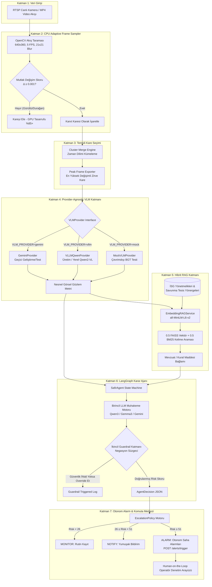

# SAFİR AI — 7 Katmanlı Otonom Video İnceleme & Saha Güvenliği Mimarisi

Bu doküman, **SAFİR AI** sisteminin 7 katmanlı mimarisini, veri akışını, kullanılan yapay zeka ajan çerçevelerini (Agentic Framework) ve büyük dil modellerini (VLM/LLM) açıklamaktadır.

---

## 🏗️ 1. 7 Katmanlı Sistem Mimarisi (Mermaid Akış Şeması)

---

## 🛠️ 2. Katman Katman Teknik Özellikler

### **Katman 1: Veri Girişi (Video Ingestion)**
- RTSP canlı güvenlik kameralarını, ağ yayınlarını ve önceden kaydedilmiş MP4 video dosyalarını destekler.

### **Katman 2: CPU Adaptive Frame Sampler (GPU Öncesi Katman)**
- Tamamen CPU üzerinde OpenCV ile çalışır.
- Kare boyutu $640 \times 360$'a indirgenir, $21 \times 21$ Gaussian Blur ile gürültü süzülür.
- Dinamik gürültü tabanı (noise floor) düşülerek $\Delta = \text{Piksel Değişimi} - \text{Gürültü Tabanı} \ge 0.001$ olan hareketli kareler ayrıştırılır.
- **GPU Tasarrufu**: Durağan sahnelerde VLM'e gönderilen kare sayısını **%80-%98 oranında azaltarak** GPU yükünü sıfırlar.

### **Katman 3: Temsili Kare Seçimi (Peak Frame Selection)**
- Yakın zamanlı kanıt karelerini zaman pencerelerine göre gruplar (clustering).
- Her grubun en yüksek hareket skorlu zirve karesini (Peak Frame) VLM'e gönderir.

### **Katman 4: Provider-Agnostic VLM Katmanı (Vision-Language Model)**
- `VLMProvider` soyut arayüzü (`analyze_frame(image_base64, prompt) -> str`) kullanır.
- **`GeminiProvider`**: Geliştirme, prototipleme ve test aşamasında geçici VLM sağlayıcısı.
- **`VLLMQwenProvider`**: Yarışma/üretim ortamında OpenAI-uyumlu local server üzerinden **Qwen2-VL** sunan provider.
- **`MockVLMProvider`**: CI/CD ve çevrimdışı birim testleri için harici bağımlılığı sıfırlayan sahte istemci.

### **Katman 5: Hibrit RAG Katmanı (İkili Kategori Yapısı: SAFETY & SECURITY)**
- `sentence-transformers/all-MiniLM-L6-v2` ile 100% yerel embedding vektörleştirmesi.
- **İkili Kategori Yapısı (Dual-Category Taxonomy)**:
  - 🏭 **SAFETY (`category: "safety"`)**: İSG Yönetmeliği Madde 12, Madde 24, Madde 31, Madde 45, Madde 52, Operasyonel Kurallar OK-07, OK-15, Yangın Güvenliği YG-03.
  - 🛡️ **SECURITY (`category: "security"`)**: Savunma Tesis Koruma Yönergeleri EK-01, SHP-02, İHA-04, SEC-01 (İzinsiz Alan Girişi), SEC-02 (Çevre Koruma Hattı/Tel Örgü İhlali), SEC-03 (Terk Edilmiş Şüpheli Nesne), SEC-04 (Yetkisiz Araç/Plaka İhlali).
- **Metadata Filtreleme & Ağırlıklandırma**: Ajan sorgularında `category_filter="safety"` veya `category_filter="security"` seçildiğinde ilgili doküman setine **%30 skor bonusu** uygulanarak en alakalı mevzuat önceliklendirilir.
- **FAISS Vektör Araması (Ağırlık: 0.5)**: Doğal dille yazılmış karmaşık durumların semantik benzerliğini yakalar.
- **BM25 Kelime Araması (Ağırlık: 0.5)**: Madde 12, EK-01, SEC-02 gibi spesifik mevzuat ve yönerge kodlarında %100 kesinlik sağlar.

### **Katman 6: LangGraph Karar Ajanı (Agentic Reasoning)**
- **Ajan Çerçevesi**: **LangGraph** durum makinesi (`StateGraph`).
- **Birincil Karar Motoru**: LLM tabanlı muhakeme motoru risk skorunu ($0-100$), güven seviyesini ve aksiyon önerilerini üretir.
- **İkincil Guardrail Katmanı**: Metinde olumsuzlama (`"kaza görülmedi"`, `"ihlal yoktur"`) bulunması durumunda güvenlik filtresi ikincil denetim yapar (`guardrail_triggered: true`).

### **Katman 7: Otonom Alarm & Komuta Merkezi (Escalation & Audit)**
- **Otonom Tetikleme (Human-on-the-Loop)**: Bloke edici operatör kapısı yoktur. Risk skoru $\ge 51$ olduğunda saha alarmı otonom tetiklenir (`POST /alerts/trigger`).
- Operatör sistemi durdurmak için değil, sonradan onaylamak (acknowledge) ve denetlemek için devrededir.

---

## 🤖 3. Kullanılan Ajan Çerçeveleri ve Modeller

| Bileşen | Kullanılan Teknoloji / Model | Geliştirme (Dev) Durumu | Üretim (Prod) Hedefi |
|---|---|---|---|
| **Agentic Framework** | **LangGraph** (StateGraph) | Aktif | Aktif |
| **Görsel Model (VLM)** | **Qwen2-VL / Gemini** | `GeminiProvider` (Geçici API) | `VLLMQwenProvider` (Yerel vLLM + Qwen2-VL) |
| **Metin Modeli (LLM)** | **Qwen3 / Gemma3 / Gemini** | Gemini / MockLLM | Yerel vLLM (Qwen3-4B-Instruct) |
| **Embedding Modeli** | **Sentence-Transformers** | `all-MiniLM-L6-v2` (Local CPU) | `all-MiniLM-L6-v2` (Local CPU) |
| **Vektör Veritabanı** | **FAISS + Rank-BM25** | Yerel (In-Memory / Disk) | Yerel (In-Memory / Disk) |
