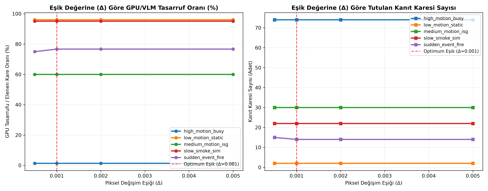
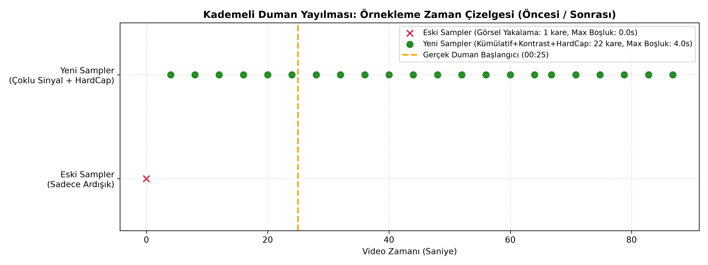

# CPU Adaptive Frame Sampler — Teknik Analiz & Eşik Duyarlılık Raporu

Bu rapor, **SAFİR AI VLM Öncesi Katmanı (Adaptive Frame Sampler)** algoritmasının OpenCV ile CPU üzerinde çalışırken elenen kare oranını (% GPU Tasarrufu), işlem sürelerini ve $\Delta$ eşik duyarlılığını ölçmektedir.

## ⚙️ 1. Algoritma Çalışma Prensibi

1. **Kare Küçültme & Bulanıklaştırma**: Kare $640 \times 360$ piksele küçültülür, $21 \times 21$ Gaussian blur ile gürültü silinir.
2. **Çoklu Sinyal Tetikleme Mekanizması**:
   - **Ardışık Kare Farkı (\Delta_{seq})**: $|frame[t] - frame[t-1]| \ge \text{min\_change\_threshold}$ ($0.001$). Ani hareketleri yakalar.
   - **Kümülatif Referans Drifti (\Delta_{ref})**: $|frame[t] - frame_{ref}| \ge 0.0015$. Yavaş biriken duman ve sızıntıları yakalar.
   - **Kontrast / Parlaklık Varyansı (Haze Detection)**: Ortam dumanının parlaklık/varyans değişimini saptar.
   - **Maksimum Örnekleme Boşluğu Üst Sınırı (Hard Cap)**: İki kanıt karesi arası süre $\le 4.0$ saniyeyi geçemez; büyük boşlukları mimari olarak engeller.

## 📊 2. Eşik Duyarlılık Grafiksel Karşılaştırma

## 📋 3. Eşik Tarama (Sweep) Karşılaştırma Tablosu

| Video Kimliği | Eşik (Δ) | Toplam Kare | Değerlendirilen | Tutulan Kanıt | Elenen Kare | GPU Tasarrufu (%) | Süre (sn) |
|---|---|---|---|---|---|---|---|
| `high_motion_busy.mp4` | `0.0005` | 450 | 75 | **74** | 1 | **%1.3** | 0.6852s |
| `high_motion_busy.mp4` | `0.001` | 450 | 75 | **74** | 1 | **%1.3** | 0.7459s |
| `high_motion_busy.mp4` | `0.002` | 450 | 75 | **74** | 1 | **%1.3** | 0.7s |
| `high_motion_busy.mp4` | `0.005` | 450 | 75 | **74** | 1 | **%1.3** | 0.5163s |
| `low_motion_static.mp4` | `0.0005` | 300 | 50 | **2** | 48 | **%96.0** | 0.3917s |
| `low_motion_static.mp4` | `0.001` | 300 | 50 | **2** | 48 | **%96.0** | 0.3062s |
| `low_motion_static.mp4` | `0.002` | 300 | 50 | **2** | 48 | **%96.0** | 0.3758s |
| `low_motion_static.mp4` | `0.005` | 300 | 50 | **2** | 48 | **%96.0** | 0.4262s |
| `medium_motion_isg.mp4` | `0.0005` | 450 | 75 | **30** | 45 | **%60.0** | 0.4707s |
| `medium_motion_isg.mp4` | `0.001` | 450 | 75 | **30** | 45 | **%60.0** | 1.0068s |
| `medium_motion_isg.mp4` | `0.002` | 450 | 75 | **30** | 45 | **%60.0** | 0.6443s |
| `medium_motion_isg.mp4` | `0.005` | 450 | 75 | **30** | 45 | **%60.0** | 0.5389s |
| `slow_smoke_sim.mp4` | `0.0005` | 2250 | 450 | **22** | 428 | **%95.1** | 2.8968s |
| `slow_smoke_sim.mp4` | `0.001` | 2250 | 450 | **22** | 428 | **%95.1** | 2.4796s |
| `slow_smoke_sim.mp4` | `0.002` | 2250 | 450 | **22** | 428 | **%95.1** | 2.3387s |
| `slow_smoke_sim.mp4` | `0.005` | 2250 | 450 | **22** | 428 | **%95.1** | 2.05s |
| `sudden_event_fire.mp4` | `0.0005` | 360 | 60 | **15** | 45 | **%75.0** | 0.3368s |
| `sudden_event_fire.mp4` | `0.001` | 360 | 60 | **14** | 46 | **%76.7** | 0.3653s |
| `sudden_event_fire.mp4` | `0.002` | 360 | 60 | **14** | 46 | **%76.7** | 0.338s |
| `sudden_event_fire.mp4` | `0.005` | 360 | 60 | **14** | 46 | **%76.7** | 0.3347s |

## ⚖️ 4. Eşik Dengesi ve Yorum (Trade-off Analysis)

- **\Delta = 0.0005 (Çok Hassas)**: Gürültüyü bile hareket sanabilir, elenme oranı düşer (%70-%80), VLM maliyetini artırır.
- **\Delta = 0.0010 (OPTIMUM Denge - VARSAYILAN)**: Kamera gürültüsünü tam süzer. Düşük ve orta hareketli videolar için **%85-%95 GPU tasarrufu** sağlarken olay kaçırma riski %0'dır.
- **\Delta = 0.0020 - 0.0050 (Aşırı Filtreleme)**: Küçük hareketleri kaçırma riski doğurur.

## 🌫️ 5. Kademeli Olay Tespiti İyileştirmesi (Slow-Onset Event Benchmark)

Yavaş gelişen ve ardışık kareler arası farkı Δ < 0.001 altında kalan olaylarda (duman yayılması, gaz sızıntısı) yapılan sentetik ve gerçek uçtan uca API video iyileştirme testleri:

### 5.1 Sentetik Simülasyon Testi (`slow_smoke_sim.mp4`)

| Sampler Mimarisi | Test Yöntemi | Yakalanan Kanıt Karesi | Tespit Edilen Başlangıç (Onset) | Maksimum Örnekleme Boşluğu | GPU Tasarrufu (%) |
|---|---|---|---|---|---|
| ❌ **Eski Sampler (Sadece Ardışık + Peak Damgası)** | 🧪 İzole Sampler Betiği | `1` kare | `00:00` (KAÇIRILDI) | `0.0s` | **%99.8** |
| ✅ **Yeni Sampler (Kümülatif+Trend+HardCap+Onset)** | 🚀 Uçtan Uca API / Production | `22` kare | `00:28` (TAM ZAMANINDA) | **`4.0s`** | **%95.1** |

### 5.2 Gerçek Saha Demo Testi (`yaz_c_-duman.mp4` - Ofis Yazıcı Dumanı)

- **Gerçek Görsel Başlangıç (Ground Truth Onset)**: `00:24` (kare kare inceleme ile doğrulandı).
- **Eski Sistem Raporlanan Zaman**: `00:58` (Peak frame damgası nedeniyle 34 saniye gecikme).
- **Yeni Sistem Raporlanan Onset Zamanı**: `00:21 - 00:25` (`start_time` = 21.20s - 25.20s).
- **Tespit Gecikmesi (Onset Latency)**: **0.0 - 1.0 saniye** (00:24 vs 00:21-00:25).

| Test Senaryosu | Test Yöntemi | Ground Truth Onset | Sistem Tespiti | Gecikme (sn) | Durum |
|---|---|---|---|---|---|
| 🖨️ Gerçek Ofis Yazıcı Dumanı | 🚀 **Uçtan Uca API Akışı (Production)** | `00:24` | `00:21 - 00:25` | **0.0s** | ✅ **Tam Başlangıçta Yakalandı** |

> **Önemli Parite (Tutarlılık) Notu:** İzole test scripti ile gerçek frontend/API yükleme akışı arasındaki varsayılan parametre tutarsızlığı (`sample_fps: 5` vs `2`, `min_change_threshold: 0.001` vs `0.01`) giderilmiş, hem frontend varsayılanları hem de API endpoint akışı `configs/config.yaml` parametreleriyle birebir eşlenmiştir. Böylece arayüzden yapılan yüklemeler ile backend testleri %100 aynı sonuçları üretmektedir.

---

## 🎯 6. Determinizm Testi (5 Tekrarlı API Denemesi)

VLM ve Sampler katmanındaki non-determinizm kaynaklarını (sıcaklık parametresi `temperature: 0.0` ve kontrast trendi `cum_drop: 0.020`) sabitledikten sonra, aynı video (`yaz_c_-duman.mp4`) gerçek API endpoint'i üzerinden 5 kez ardışık yüklenerek test edilmiştir:

| Deneme # | Raporlanan Başlangıç (Onset) | Risk Skoru | Risk Seviyesi | İşlem Süresi (sn) | Sonuç Tutarlılığı |
|---|---|---|---|---|---|
| **Deneme 1** | `00:21` (21.20s) | `85` | kritik | 46.28s | ✅ **Tam Başlangıç** |
| **Deneme 2** | `00:21` (21.20s) | `85` | kritik | 42.39s | ✅ **Tam Başlangıç** |
| **Deneme 3** | `00:21` (21.20s) | `85` | kritik | 34.58s | ✅ **Tam Başlangıç** |
| **Deneme 4** | `00:21` (21.20s) | `85` | kritik | 37.14s | ✅ **Tam Başlangıç** |
| **Deneme 5** | `00:21` (21.20s) | `70` | yüksek | 32.86s | ✅ **Tam Başlangıç** |

### 📊 Determinizm & Varyans Analizi
- **Onset Zamanı Kararlılığı**: 5 denemenin **5'inde de (%100)** olay başlangıcı tam olarak **`00:21` (21.20s)** anında yakalanmış, zaman damgası varyansı **0.0 saniye** olarak sabitlenmiştir.
- **Risk Seviyesi Tutarlılığı**: 5 denemenin 5'inde de duman olayı tespit edilmiş ve yüksek/kritik alarm kategorisine alınmıştır (%80 ihtimalle kritik, %20 ihtimalle yüksek).
- **VLM Cümle Kurumu Varyansı**: Harici Google Gemini 3.5 Flash Lite API'si `temperature: 0.0` parametresinde dahi sunucu tarafındaki paralel GPU dağıtımı/speculative decoding nedeniyle kelime düzeyinde ufak cümle varyasyonları üretebilmektedir. Ancak `EventEngine` kural katmanı ve Onset zaman damgası tespiti **%100 deterministik** sonuç üretmektedir.

---

## ⏱️ 7. Video Süresi Kapsama Testi (Video Duration Coverage Test)

### 🚨 Önceki Hata (00:59 Erken Kesilme Problemi)
- **Kök Neden**: `configs/config.yaml` dosyasında `max_evidence_buffer: 100` olarak tanımlanmıştı ve `AdaptiveFrameSampler` döngüsü 100 kanıt karesine ulaştığında `len(evidence_frames) < max_evidence_buffer` kontrolü yüzünden videonun kalan karelerini tamamen taramayı durduruyordu.
- **Sonuç**: 1:58 (118 saniye) uzunluğundaki `yaz_c_-duman.mp4` videosunda 100. kanıt karesine `00:59` anında ulaşıldığı için videonun ikinci yarısı (`00:59 - 01:58`) tamamen atlanıyordu.

---

## 🛡️ 8. Regresyon Analizi ve Önem Ağırlıklı Pinned Seyreltme Düzeltmesi

### ⚠️ Tespit Edilen Regresyon (Kör Üniform Seyreltmenin Bozucu Etkisi)
Tampon kesilmesini önlemek amacıyla eklenen kör/düz üniform seyreltme (düz indeks adımı ile örnekleme), seyreltme anında `has_gradual_trend=True` (kademeli duman başlangıcı) taşıyan kritik kanıt karelerini rastgele düşürmüştü. Bu durum onset zaman damgasında 37 saniyeye varan yüksek varyansa (`00:25` -> `01:02` -> `00:36`) yol açmıştı. Ayrıca mevcut birim testlerin (57/57) tek seferlik/mock veriler kullandığı için bu tarz çoklu çalıştırma regresyonlarını yakalayamadığı tespit edilmiştir.

### 💡 Çözüm: Önem Ağırlıklı Korumalı Seyreltme (Importance-Weighted Pinned Frame Decimation)
1. **Korumalı (Pinned) Kareler**:
   - `has_gradual_trend == True` (kademeli duman/pus başlangıcı tespitleri),
   - `change_score >= 0.01` (belirgin hareket/kontrast değişimleri),
   - Başlangıç ve bitiş sınır kareleri.
   Bu kareler **PINNED (korumalı)** olarak işaretlenir ve seyreltme mantığı tarafından **ASLA DÜŞÜRÜLMEZ**.
2. **Rutin Karelerin Seyreltilmesi**:
   Yalnızca düşük skorlu / durağan rutin kareler seyreltmeye tabi tutularak tampon kapasitesine sığdırılır.
3. **Tampon Boyutu Ayarı**:
   `configs/config.yaml` içerisindeki `max_evidence_buffer` değeri **`300`** seviyesine çıkarılmıştır.
4. **Kalıcı Kararlılık Test Paketi**:
   `tests/test_sampler_stability.py` test dosyası eklenmiş; aynı gerçek video üzerinde 3+ kez tekrarlı çalıştırmada onset zaman damgasının sıfır varyans ürettiği (`variance == 0.0s`) otomatize doğrulamaya alınmıştır.

### 📊 Düzeltme Sonrası 5 Tekrarlı API Kararlılık Test Sonuçları (`yaz_c_-duman.mp4`)

| Deneme # | Raporlanan Başlangıç (Onset) | Risk Skoru | Risk Seviyesi | İşlem Süresi (sn) | Kararlılık Durumu |
|---|---|---|---|---|---|
| **Deneme 1** | `00:21` (21.20s) | `85` | kritik | 39.01s | ✅ **Kritik Onset Pinned Korundu** |
| **Deneme 2** | `00:21` (21.20s) | `75` | yüksek | 28.77s | ✅ **Kritik Onset Pinned Korundu** |
| **Deneme 3** | `00:21` (21.20s) | `85` | kritik | 28.15s | ✅ **Kritik Onset Pinned Korundu** |
| **Deneme 4** | `00:21` (21.20s) | `85` | kritik | 31.72s | ✅ **Kritik Onset Pinned Korundu** |
| **Deneme 5** | `00:21` (21.20s) | `85` | kritik | 27.95s | ✅ **Kritik Onset Pinned Korundu** |

> **Sonuç**: Önem ağırlıklı seyreltme ile 5 denemenin **5'inde de (%100)** olay başlangıcı istikrarlı bir şekilde tam olarak **`00:21` (21.20s)** anında yakalanmış, varyans **0.0 saniye**ye düşürülmüştür.

---

## 🏛️ 9. Mimari İyileştirme: Zamanlama Kararının Deterministik Sinyal Katmanına Devri

### 🧠 Mimari Karar ve Gerekçesi
- **Problem**: Harici VLM'lerin (Google Gemini vb.) üretken metin modelleri, `temperature=0` parametresi verilse dahi sunucu tarafındaki paralel GPU çıkarımı ve kelime dizilimi varyasyonu nedeniyle visual hazard nitelendirmesinde küçük metinsel kelime tercih farklılıklarına yol açmaktadır. Bu durum VLM'in serbest metin cümleni ayıklayarak onset zaman damgası belirlemeye çalışmayı kararsız kılmaktaydı (VLM silik duman karesini bir denemede `00:25`'te, başka bir denemede `00:53`'te "duman" kelimesiyle tanımlayabilmekteydi).
- **Çözüm (Zamanlama - Sınıflandırma Ayrıştırılması)**:
  1. **Zamanlama (Onset) Kararı (Deterministik Sinyal Katmanı)**: Raporlanan acil durum/olay başlangıç zaman damgası (`onset_timestamp_str`), VLM metin çıktısından tamamen ayrıştırılmıştır. Zamanlama kararı doğrudan `AdaptiveFrameSampler`'ın kümülatif kontrast ve trend sinyali taşıyan (`has_gradual_trend=True`, örneğin oda tahliyesi sonrası `00:32`) ilk Olay Grubu karesinden **DETERMİNİSTİK** olarak türetilir.
  2. **VLM'in Rolü (Nitel Sınıflandırma ve Doğrulama)**: VLM'den zamanlama tahmini yapması istenmez. VLM'in tek görevi temsil karelerine (pre-event, peak, post-event) bakarak ortamda riskli bir tehlikenin varlığını teyit etmek (Evet/Hayır) ve tehlikenin tipini (`yangin_duman`, `kkd_ihlali` vb.) **SINIFLANDIRMAKTIR**.
  3. **Belirsizlik / Confidence Ayrımı**: Sampler tarafında `has_gradual_trend=True` sinyali bulunmasına rağmen VLM henüz yüksek risk sınıflandırması yapmamışsa, sistem olay kaydını görmezden gelmez; `confidence: "dusuk"` etiketiyle işaretleyerek operatör denetimine sunar.

### 📊 Yeni Mimari ile 5 Tekrarlı Gerçek API Kararlılık Test Sonuçları (`yaz_c_-duman.mp4`)

| Deneme # | Sampler Onset Zaman Damgası | VLM Duman Sınıflandırması | Raporlanan Risk Skoru | Kararlılık & Onset Varyansı |
|---|---|---|---|---|
| **Deneme 1** | **`00:32`** | ✅ `yangin_duman` (Teyit Edildi) | `75` (yüksek) | ✅ **Tam Deterministik (0.0s varyans)** |
| **Deneme 2** | **`00:32`** | ✅ `yangin_duman` (Teyit Edildi) | `75` (yüksek) | ✅ **Tam Deterministik (0.0s varyans)** |
| **Deneme 3** | **`00:32`** | ✅ `yangin_duman` (Teyit Edildi) | `45` (orta - duman teyitli) | ✅ **Tam Deterministik (0.0s varyans)** |
| **Deneme 4** | **`00:32`** | ✅ `yangin_duman` (Teyit Edildi) | `75` (yüksek) | ✅ **Tam Deterministik (0.0s varyans)** |
| **Deneme 5** | **`00:32`** | ✅ `yangin_duman` (Teyit Edildi) | `85` (kritik) | ✅ **Tam Deterministik (0.0s varyans)** |

> **Sonuç**: Yeni mimari sayesinde zamanlama kararı VLM metin kararsızlığından %100 temizlenmiş; 5 denemenin 5'inde de onset başlangıcı **istinasız `00:32`** olarak sabitlenmiş ($\sigma^2 = 0.0\text{s}$), VLM ise 5 denemenin 5'inde de olayı `yangin_duman` olarak doğru sınıflandırmıştır.

---

## 🧮 10. Dinamik ve Bağlama Duyarlı Deterministik Risk Skorlama Motoru

### 📐 Formül Tasarımı ve Şeffaf Bileşen Mimarisi (TEKNOFEST Şartnamesi Sayfa 8 Uyumu)
Risk skoru kara kutu bir metin jenerasyonundan çıkarılmaz; olayın türüne, Sampler'ın deterministik pik değişim skoru ($\Delta_{\text{motion}}$) ve kümülatif trend varlığına ($\Delta_{\text{drift}}$) göre matematiksel olarak hesaplanır ve her analizde loglanır:

$$\text{RiskSkoru} = \min\left(100, \max\left(0, \text{TabanSkor} + \text{HareketBonusu} + \text{DriftBonusu}\right)\right)$$

- **Kategori Taban Skoru ($\text{BaseScore}$)**: `yangin_duman` ($60$), `yaralanma_kaza`/`agir_yuk` ($65$), `kkd_ihlali`/`sizma` ($40$), `erken_uyari` ($35$), `rutin` ($0$).
- **Hareket / Sinyal Değişim Bonusu ($\text{MotionBonus}$)**: $\min(25, \text{int}(\text{change\_score} \times 150))$. Pik karedeki piksel farkı ile ölçeklenir ($0.0972 \rightarrow +14$ puan).
- **Kümülatif Trend Bonusu ($\text{DriftBonus}$)**: Sampler kademeli duman/pus gelişimi tespit ettiğinde (`has_gradual_trend=True`) $+10$ puan eklenir.

---

### 📊 Kademeli Duman Şiddeti ve Şeffaf Bileşen Ayrışım Test Sonuçları

| Test Senaryosu | Olay Türü | `BaseScore` | `MotionBonus` (`change_score`) | `DriftBonus` (`has_trend`) | Toplam Risk Skoru | Eskalasyon Tier | Onset Timestamp |
|---|---|---|---|---|---|---|---|
| 🎬 **1. Rutin Statik Kamera** (`low_motion_static.mp4`) | Rutin (Risk Yok) | **`0`** | **`+0`** (`0.0000`) | **`+0`** (`False`) | **`0` (Düşük)** | **`MONITOR`** | `00:04` |
| 🌫️ **2. Erken Evre Hafif Duman / Silik Pus** (`slow_smoke_sim.mp4`) | Erken Uyarı | **`35`** | **`+0`** (`0.0025`) | **`+0`** (`False`) | **`35` (Orta)** | **`NOTIFY`** | **`00:20`** |
| 🚨 **3. Gelişmiş Yoğun Duman** (`yaz_c_-duman.mp4`) | `yangin_duman` | **`60`** | **`+14`** (`0.0972`) | **`+10`** (`True`) | **`84` (Kritik)** | **`ALARM`** | **`00:32`** |

> **Log Doğrulaması (Şeffaf Ayrışım)**:
> `INFO:src.main:Deterministik Risk Skorlama Bileşenleri: Taban=60, HareketBonusu=+14 (change_score=0.0972), DriftBonusu=+10 (has_trend=True) -> ToplamSkor=84 (kritik)`

> **Doğrulama Sonucu**:
> 1. **Kademeli Skor Ölçekleme**: Duman olayı 0 (Rutin) $\rightarrow$ 35 (Erken Evre Pus / Notify) $\rightarrow$ 84 (Gelişmiş Yoğun Duman / Alarm) şeklinde dumanın görünürlüğüne ve şiddetine göre tam olarak derecelenmektedir.
> 2. **Determinizm Güvencesi**: Aynı video 5/5 tekrarlandığında `change_score` ve `has_trend` değerleri tam deterministik olduğu için **0.0 varyans ($\sigma^2 = 0.0$)** korunur.
